# HTML- Web Design

Data is more powerful when its shared! I am excited to share with you my analysis of the impact of Latitude on Weather conditions. In this user-friendly website you will see charts and table illustrations of my research on weather conditions in relationship to latitude. This website is very interactive and has live animations as well as the capability to link several ways between pages. It will also update the scale of the format depending on the size screen you are viewing it on! Please Enjoy!

[Weather vs. Latitude](https://ssimoes48.github.io/Web-Design-Challenge/)

## Table of contents
* [Technologies](#technologies)
* [NavBar](#navbar)
* [Home Page](#home-page)
* [Comparison](#comparison)
* [Weather Analysis](#weather-analysis)
* [Data](#data)
* [Sizing](#sizing)
* [Resources](#resources)
* [Contact](#contact)

## Technologies 
 * HTML
 * Bootstrap
 * CSS
 
## NavBar

At the top of my website, there is navigation bar. To create this bar I used code from `BootStrap` . The NavBar includes:

* A home page button which is featured on ever page and will return you to the summary landing page
* A Plots Dropdown menu that includes links to my 4 weather summaries
* A Comparison link to that shows a page with all 4 weather summaries in a grid formation
* A Data link that takes you to a page with the data table used to plot my results

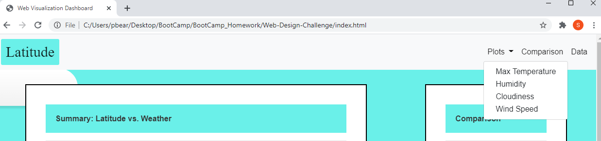

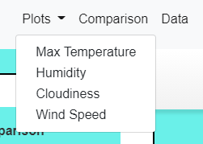

The code for the Nav Bar came from the Bootstrap documentation page. I added formatting in my `.css ` file to change the color, font and padding of the bar. I also added a function to show a cursor pointer on the mouse when you hover over the links. To make the orientation of the links on the left, I used the code `align-items: left` . 

## Home Page

My home page is made up of one large `container` class with 2 smaller `containers` inside. With this layout, I was able to use the `grid` format to arrange my containers on the page. The main `container` includes my summary of the project. It is located in row 1, column size 8. My second container is smaller and sits on the right side of the page. It is located in row 1 but in column size 4. I used `.css` formatting to adjust the size of my margins and padding to make the images as easy to view as possible. 

Within my second container called ‘Comparison’ , I have 4 images of my 4 plots also arranged in a `grid` format. Each image is a live link to the corresponding plots main page. This ‘Comparison’ container is located on each page for easy browsing. 

For added fun, I included a cloud animation that runs in the background of each of my pages on this site. I found the animation code from a site called [CodePen](https://codepen.io/Mark_Bowley/pen/xEbuI) . The main code lives on each `.html` page but there is also a supplementary `.css` file that I linked to each page as well. 

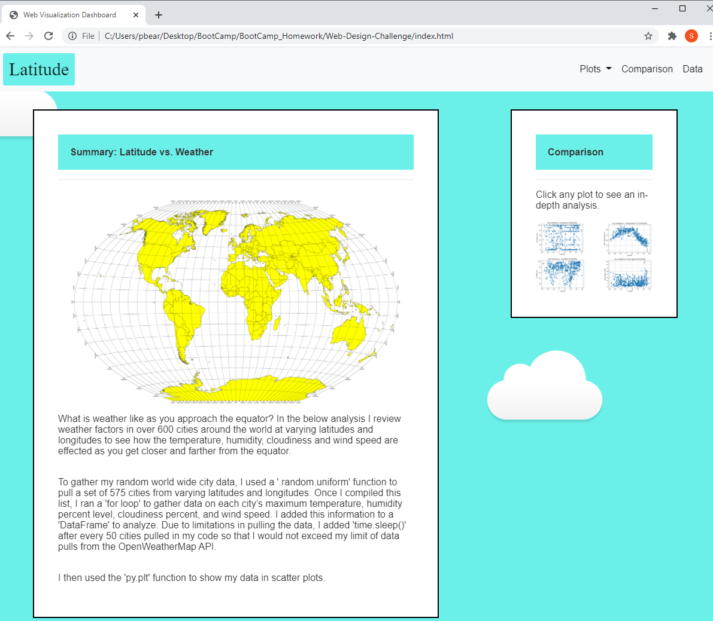

## Comparison

My ‘Comparison’ page includes one `container` inside a larger `container` that is the whole page. This helped me to format the location of the ‘Comparison’ box. Within the box, there are 4 images that are active links to the corresponding plots main page. 

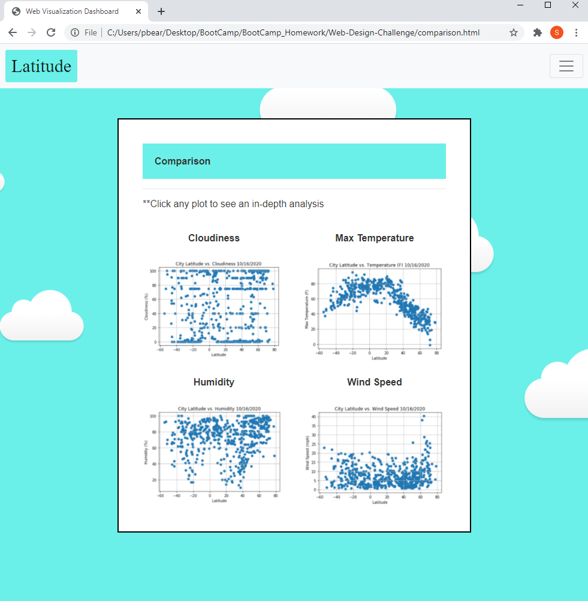

## Weather Analysis 

For each of my weather analysis pages, I used the same format as the home page- a large `container` with 2 smaller `containers` inside and used the `grid` format to arrange them. I also added code in my `.css` to make the font size `inherit` and the images `fluid`. This helps the page re-size when scaling. 

There are a total of 4 data pages including scatter plots created in `jupyter notebook`. 

* Max-Temp
* Humidity
* Cloudiness
* Windspeed

These pages can be reached by clicking on the `Plots` Dropdown menu, by clicking on the images in the “Comparison” side bar and by clicking on the images in the “Comparison” page. 

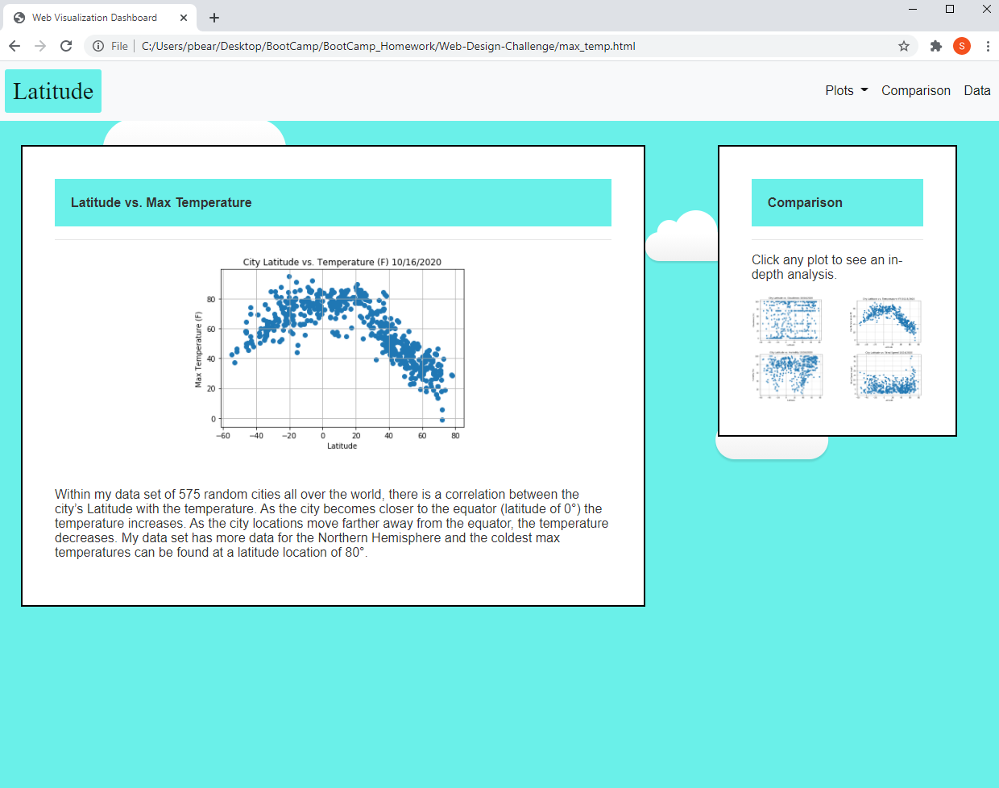

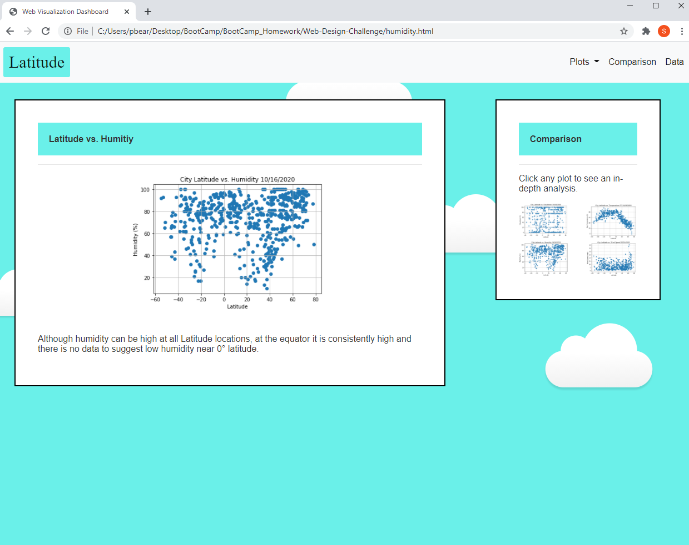

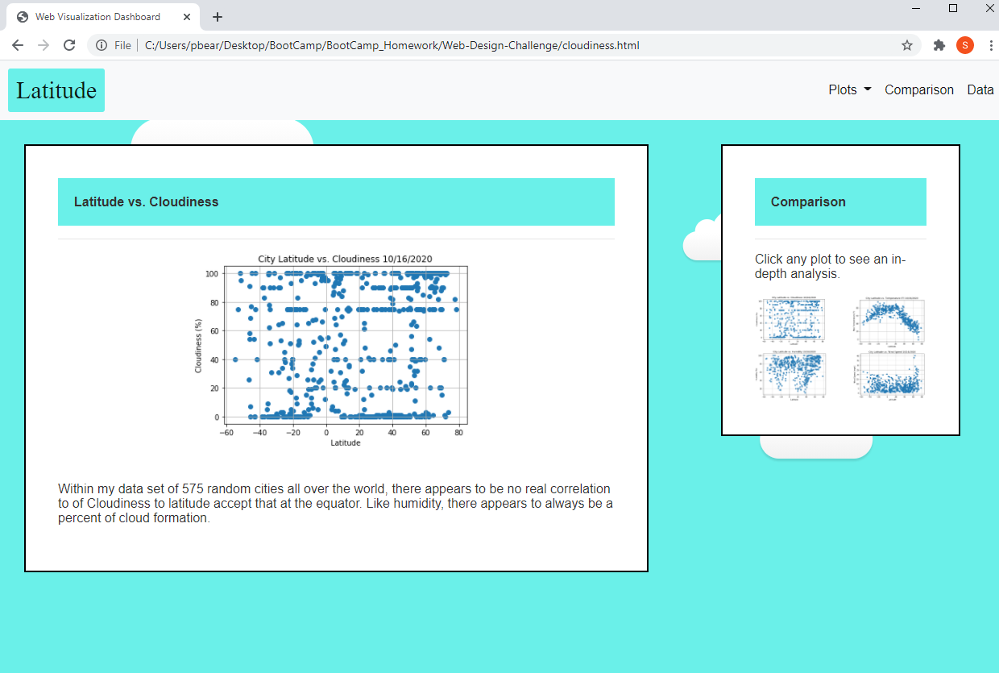

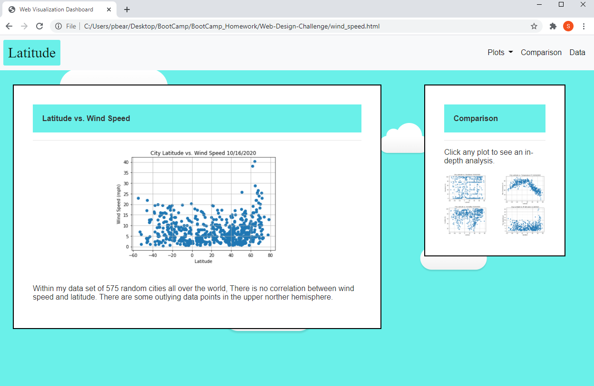

## Data

My Data page shows a table of the data used to plot my weather analysis. In `’jupyter notebook` the data is in a `.csv` format. To add it to the web site and make it browsable, I had to convert the `.csv` file into `.html` format. I did this in my `jupyter notebook` by using the code `df.to_html( ) ` . This created a file that was `.html` that can be viewed in an internet browser. 

I added the table to my website with the class “table-responsive” and then copied the data from my data.html file into the class. With “table-responsive” you can scroll across the table regardless of the size of the screen is. 

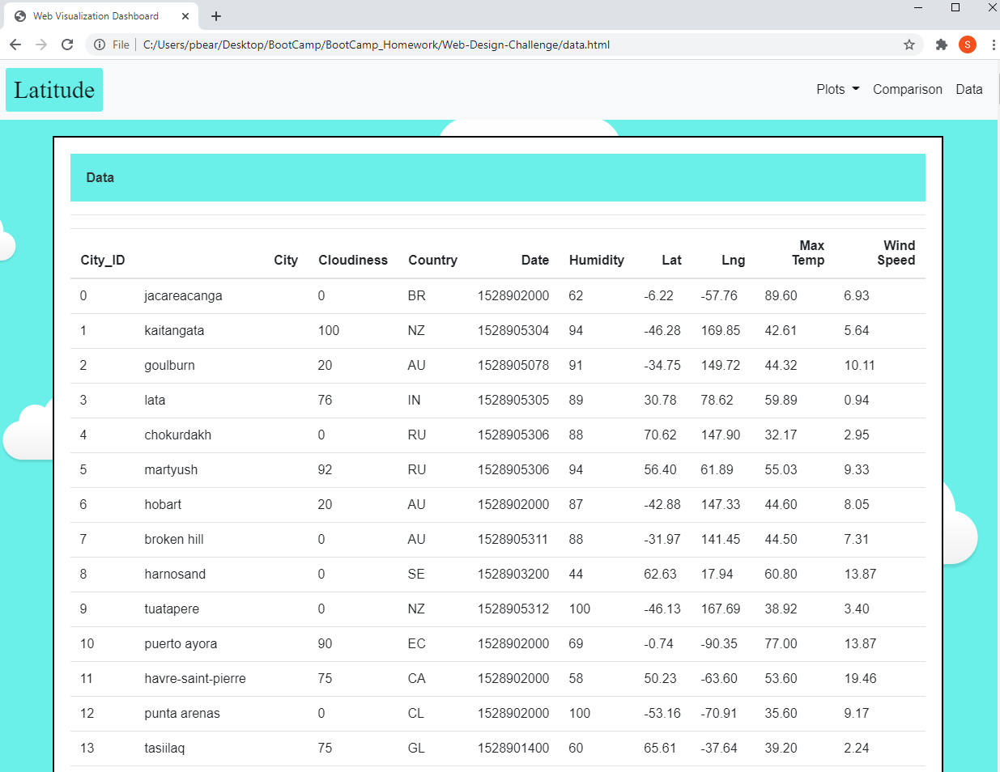

## Sizing

My website responds to changes in screen size. It can be viewed on a large monitor, a medium tablet, or a small smart phone. When you reduce the screen width, the nav bar collapses and becomes a drop-down button. Also, the 2 containers stack on top of each other instead of being side to side. 

To make my pages responsive, I added extra code guidelines like `image-fluid` , ‘container-fluid` and `width: auto` .

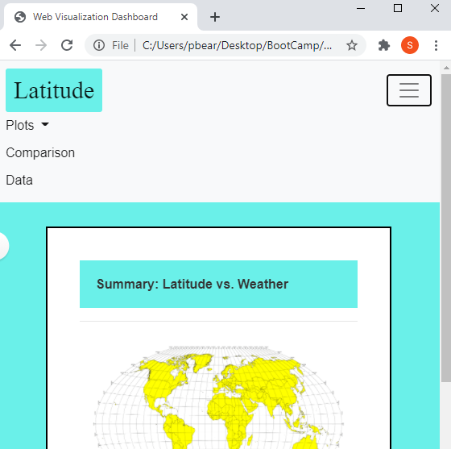

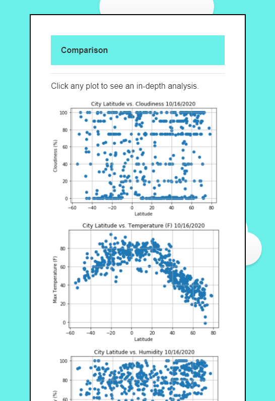

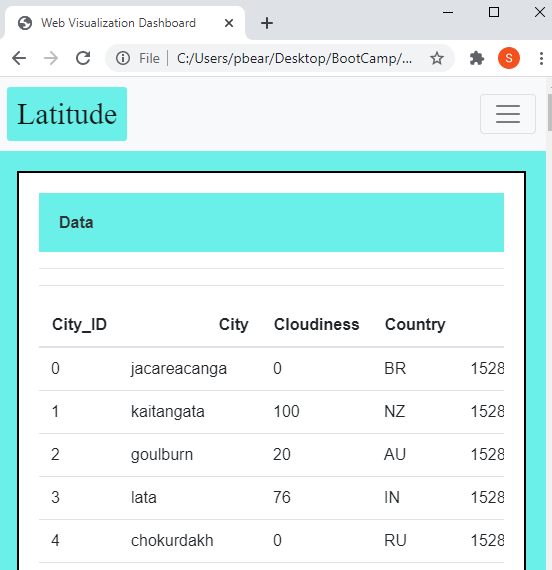

## Resources

For my animation, I used code from: [Mark Bowley](https://codepen.io/Mark_Bowley/pen/xEbuI)

Weather Data Source: [WeatherPy](https://github.com/Ssimoes48/Python_API.git)

My Website: [Weather vs. Latitude](https://ssimoes48.github.io/Web-Design-Challenge/)

## Contact
[Sara Simoes](https://github.com/Ssimoes48)
